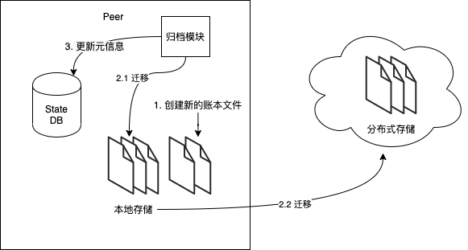
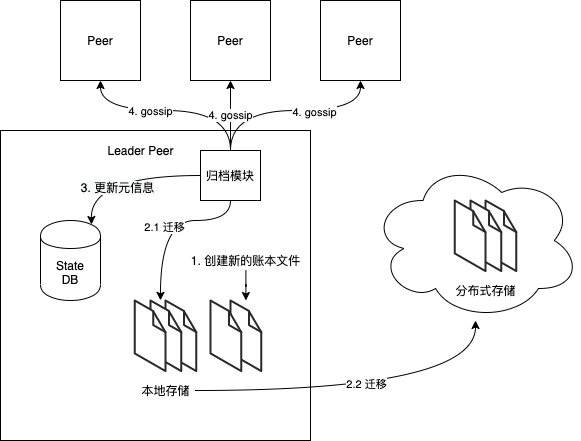
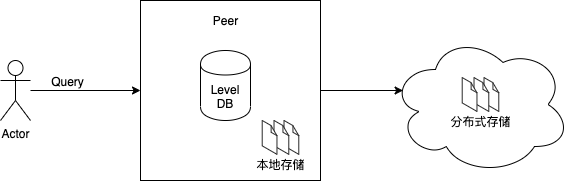

# Ledger Archive

> 作者：彭洪伟（MaxPeng）
>
> 邮件：pengisgood@gmail.com
>
> 最后更新时间：2020年06月12日

**Ledger** 是 Hyperledger Fabric 的一个关键概念。它存储了有关业务对象的重要的事实的信息，既包含属性的当前值，也包含当前值随着历史交易的变化过程。

在本主题中，我们将介绍以下几个方面：

* [账本现状](#账本现状)
* [归档设计概览](#归档设计概览)
* [组件](#组件)
	* [分布式文件存储](#分布式文件存储)
	* [迁移服务](#迁移服务)
	* [归档服务](#归档服务)
	* [Gossip归档元信息](#Gossip归档元信息)
	* [查询API](#查询API)

## 账本现状

目前 Hyperledger Fabric 中的 Ledger 部分使用本地文件系统进行存储，并且 Hyperledger Fabric 的区块数据结构嵌套很深，单个区块的体积比较大。随着系统的运行，数据量会越来越大，本地文件系统只能垂直扩展，无法水平扩展，无法支持长时间甚至永久存储存储区块链的数据。

## 归档设计概览

考虑区块链的数据需要长时间保存，同时还需要提供历史数据查询。采用常规的方式，将历史数据归档到冷存储无法直接提供历史数据查询功能；而直接将账本中的区块链数据存储改成分布式存储，又会让近期数据的查询性能大幅下降。因此本设计采用近期数据存本地、历史数据存远程的混合存储方式，然后修改历史数据的查询逻辑，按需查询本地账本或者远程账本。远程账本则直接采用成熟的分布式存储技术（比如 Ceph、HDFS、IPFS）实现，暂不在本设计关心的范围内。本设计中采用的是 HDFS 和 IPFS 作为实现案例，不过已经充分考虑到了可扩展性，根据业务的需要，可以很容易的替换底层分布式存储方案。

## 组件

整个归档功能的涉及到的改动如下，本着最小侵入 Hyperledger Fabric 的原则，尽量采用扩展的方式添加新代码，而非直接修改已有逻辑。

### 分布式文件存储

分布式存储采用现有成熟的开源系统，比如 Ceph、HDFS、IPFS，一般分布式文件存储已经暴露了和本地文件系统类似的 API，底层也已经实现了自动的分片扩容，本设计不关心分布式文件存储的底层实现，仅以 HDFS 和 IPFS 作为案例，参考 HDFS 或者 IPFS 扩展至其他的分布式系统也比较容易。

针对不同的底层的分布式存储，定义了一套统一的接口，用来屏蔽底层存储系统的差异性，尽量做到用户无感知。目前只有 HDFS 和 IPFS 的实现，如果需要扩展其他的分布式存储，实现相应的接口即可。

```go
type FsReader interface {
	io.ReaderAt
	io.Seeker
	io.Reader
	io.Closer
	Stat() os.FileInfo
}

type FsClient interface {
	ReadDir(dirname string) ([]os.FileInfo, error)
	Stat(name string) (os.FileInfo, error)
	CopyToRemote(src string, dst string) error
	Open(name string) (FsReader, error)
	Close() error
}
```

选择不同的分布式存储时，需要配置相应的参数，首先需要在 `core.yaml` 中配置，在 Peer 启动时会解析成以下结构：

```yaml
ledger:
  archive:
    enable: false
    # type - options are "hdfs", "ipfs"
    type: ipfs
    hdfsConfig:
      nameNodes:
        - xx.xx.xx.xx:9000
      # It specifies which HDFS user the client will act as.
      user: hdfs
      useDatanodeHostname: false
    ipfsConfig:
      url: xx.xx.xx.xx:5001
```


```go
type Config struct {
	// dfs type, supported values: hdfs, ipfs
	Type     string
	HdfsConf *HdfsConfig
	IpfsConf *IpfsConfig
}

type HdfsConfig struct {
	// HDFS user
	User string

	// HDFS namenode addresses
	NameNodes []string

	// Docker DNS config is needed when this value is true
	UseDatanodeHostname bool
}

type IpfsConfig struct {
	// IPFS api url, example: 127.0.0.1:5001
	Url string
}

```


### 迁移服务



该服务的主要职责是将 Peer 节点上的账本文件复制到远端的分布式存储中，该服务只在 Leader Peer 节点上启动。对于动态选举的情景，在每次选举结束之后的 `onStatusChange`方法中启动该服务，之前在其他节点启动的服务会自动停止；对于设置为静态的 Leader 情景，会在 Leader 节点启动的时候启动该服务。静态 Leader 的设置，可能存在单点故障，因此不推荐在生产环境使用。

该服务会以 Go Routine 的方式启动，然后去监控账本目录下文件的变化，一旦有新的账本文件创建，就会根据归档元信息判断，如果 LastSentFileSuffix + 2 号账本文件已经存在，则复制 LastSentFileSuffix 号文件到远端，同时也会检查 LastSentFileSuffix 号之前的文件，如果没有复制，则会从之前的文件开始复制，这样可以避免一次性复制过多的文件导致性能开销过大，也可以保证在查询最近的区块时不用从远端查询。

该服务对外提供的接口如下，由于账本本身的设计就是按照通道进行数据隔离的，该服务的启动和停止的控制也是通道级别的。

``` go
type archiveSvc interface {
   // StartWatcherForChannel dynamically starts watcher of ledger files.
   StartWatcherForChannel(chainID string) error

   // StopWatcherForChannel dynamically stops watcher of ledger files.
   StopWatcherForChannel(chainID string) error

   // Stop stops watcher of ledger files.
   Stop()
}
```

Fabric hyperledger 底层设计了 BlockStore 接口，用于实际操作账本。当前的默认实现为 fsBlockStore，即基于本地文件系统来实现，操作具体账本文件的时候依赖于底层的 blockfileMgr；我们重新实现一个 HybridBlockStore，使用扩展后的 hybridBlockfileMgr 来处理账本复制相关的逻辑。

``` go
type BlockStore interface {
   TransferBlockFiles() error //用于处理具体的账本文件复制逻辑
   AddBlock(block *common.Block) error
   GetBlockchainInfo() (*common.BlockchainInfo, error)
   RetrieveBlocks(startNum uint64) (ledger.ResultsIterator, error)
   RetrieveBlockByHash(blockHash []byte) (*common.Block, error)
   RetrieveBlockByNumber(blockNum uint64) (*common.Block, error) // blockNum of math.MaxUint64 will return last block
   RetrieveTxByID(txID string) (*common.Envelope, error)
   RetrieveTxByBlockNumTranNum(blockNum uint64, tranNum uint64) (*common.Envelope, error)
   RetrieveBlockByTxID(txID string) (*common.Block, error)
   RetrieveTxValidationCodeByTxID(txID string) (peer.TxValidationCode, error)
   Shutdown()
}

type hybridBlockStore struct {
   id      string
   conf    *Conf
   fileMgr *hybridBlockfileMgr //封装处理账本文件的相关逻辑
   stats   *ledgerStats
}
```

hybridBlockfileMgr 会在 Peer 节点启动的时候初始化，主要增加了账本复制的元信息，以及必要的并发控制相关的变量，这些信息都会存储到 LevelDB 中。在启动的时候，会根据远端和本地的账本文件信息初始化归档元信息。

在扩展的结构中，amInfo 用来存储归档的元信息，其中 LastSentFileSuffix 保存已经复制到远端的最大文件编号，LastArchiveFileSuffix 保存已经从 Peer 节点删除的最大文件编号，FileProofs 保存账本文件的校验码，后续可以用来验证远端的账本文件内容是否完整。amInfoCond 和 lock 用于在更新元信息时的并发控制。dfsClient 为底层分布式存储的抽象，用来和分布式存储系统进行交互。

``` go
type hybridBlockfileMgr struct {
   rootDir           string
   conf              *Conf
   db                *leveldbhelper.DBHandle
   index             index
   cpInfo            *checkpointInfo
   cpInfoCond        *sync.Cond
   currentFileWriter *blockfileWriter
   bcInfo            atomic.Value

   // 归档元信息
   amInfo            *archive.ArchiveMetaInfo
   amInfoCond        *sync.Cond
   dfsClient         common.FsClient
   lock              sync.RWMutex
}
```

``` protobuf
message ArchiveMetaInfo {
    int32 last_sent_file_suffix = 1;
    int32 last_archive_file_suffix = 2;
    map<int32, string> file_proofs = 3;
}
```

### 归档服务

* ASCC 系统链码

和其他的系统链码一样，ASCC 系统链码会在 Peer 节点启动的时候启动，提供接口来触发归档的执行。类似 QSCC 的实现，用户可以直接通过调用 ASCC 的方法来执行归档。目前支持按照交易的时间戳归档，精确到天。后续可以考虑扩展其他的归档规则，比如区块高度、存储大小等。

```go
package ascc

import (
	...
)

const (
	//invoke functions
	ArchiveByDate string = "archiveByDate"
)

var logger = flogging.MustGetLogger("ascc")

type ArchiveSysCC struct {
	aclProvider aclmgmt.ACLProvider
	// PolicyChecker is the interface used to perform
	// access control
	policyChecker policy.PolicyChecker
}

// New returns an instance of ASCC.
// Typically this is called once per peer.
func New(aclProvider aclmgmt.ACLProvider, policyChecker policy.PolicyChecker) *ArchiveSysCC {
	return &ArchiveSysCC{
		aclProvider:   aclProvider,
		policyChecker: policyChecker,
	}
}

func (a *ArchiveSysCC) Name() string { return "ascc" }

func (a *ArchiveSysCC) Chaincode() shim.Chaincode { return a }

// Init initializes ASCC
func (a *ArchiveSysCC) Init(stub shim.ChaincodeStubInterface) pb.Response {
	logger.Info("Init ASCC")
	return shim.Success(nil)
}

// Invoke is called with args[0] contains the query function name, args[1]
// contains the chain ID, which is temporary for now until it is part of stub.
// Each function requires additional parameters as described below:
// # ArchiveByDate: Archive the block files which contains tx date before the specified date in args[2]
func (a *ArchiveSysCC) Invoke(stub shim.ChaincodeStubInterface) pb.Response {
	args := stub.GetArgs()

	if len(args) < 2 {
		logger.Errorf("ASCC - Incorrect number of arguments, %d", len(args))
		return shim.Error(fmt.Sprintf("Incorrect number of arguments, %d", len(args)))
	}

	function := string(args[0])
	cid := string(args[1])

	logger.Infof("ASCC - invoke function: %s on chain: %s", function, cid)

	// Handle ACL:
	// 1. get the signed proposal
	sp, err := stub.GetSignedProposal()
	if err != nil {
		logger.Errorf("ASCC - GetSignedProposal got error: %s", err)
		return shim.Error(fmt.Sprintf("Failed retrieving signed proposal on executing %s with error %s", function, err))
	}

	switch function {
	case ArchiveByDate:
		if function != ArchiveByDate && len(args) < 3 {
			logger.Errorf("ASCC - missing 3rd arg for: %s", function)
			return shim.Error(fmt.Sprintf("missing 3rd argument for %s", function))
		}
		// 2. check archive by date policy
		if err = a.aclProvider.CheckACL(resources.Ascc_ArchiveByDate, cid, sp); err != nil {
			logger.Errorf("ASCC - access denied for [%s]: %s", function, err)
			return shim.Error(fmt.Sprintf("access denied for [%s]: %s", function, err))
		}
		return archiveByDate(stub, args[2])
	default:
		logger.Errorf("ASCC - requested function %s not found in ASCC.", function)
		return shim.Error(fmt.Sprintf("Requested function %s not found in ASCC.", function))
	}
}

func archiveByDate(stub shim.ChaincodeStubInterface, date []byte) pb.Response {
	if err := stub.PutState("ascc~byTxDate", date); err != nil {
		logger.Errorf("ASCC - archiveByDate put state got error: %s", err)
		return shim.Error(fmt.Sprintf("ASCC put state got error: %s", err))
	}
	return shim.Success(nil)
}

```

调用链码的例子：

```bash
$ docker exec -it cli sh

$ peer chaincode invoke -o orderer.example.com:7050 --tls true --cafile /opt/gopath/src/github.com/hyperledger/fabric/peer/crypto/ordererOrganizations/example.com/orderers/orderer.example.com/tls/ca.crt -C mychannel -n ascc -c '{"Args":["archiveByDate","mychannel","2020-06-12"]}'
```

* 归档事件

ASCC 系统链码执行成功之后，会触发一个事件（ARCHIVE_BY_TX_DATE），用来通知归档服务去删除本地待归档的账本文件。blockfile_mgr 在初始化的阶段会建立交易时间戳和区块位置对应的索引，并且订阅该事件。在收到该事件通知后，根据索引找到对应的文件编号，删除本地待归档的账本文件。

### Gossip归档元信息



账本文件的复制只会发生在 Leader 节点，因此归档的元信息就需要从 Leader 节点通过 Gossip 广播给通道里其他的 Peer 节点，其他的节点收到 Gossip 消息之后，更新到自己的 LevelDB 中。

增加的Gossip消息类型如下，

``` protobuf
// ArchiveMsg is used for peer leader to broadcast its archive meta information
// to other peers
message ArchiveMsg {
    ArchiveMetaInfo archive_meta_info = 1;
}

message ArchiveMetaInfo {
    int32 last_sent_file_suffix = 1;
    int32 last_archive_file_suffix = 2;
    map<int32, string> file_proofs = 3;
}
```

在 Leader 节点启动迁移服务的时候和有新的账本文件创建的时候都会触发Gossip，构造的消息如下，

``` go
gossipMsg := &GossipMessage{
    Nonce:   0,
    Tag:     proto.GossipMessage_CHAN_ONLY,
    Channel: []byte(chainID),
    Content: &proto.GossipMessage_ArchiveMsg{
        ArchiveMsg: &proto.ArchiveMsg{
            ArchiveMetaInfo: metaInfo,
        },
    },
}
```

### 查询API

查询时主要分为两类，一类 QSCC 中涉及到的几类查询；另一类是查询一个 Key 对应的交易历史。

``` go
switch fname {
   case GetTransactionByID:
      return getTransactionByID(targetLedger, args[2])
   case GetBlockByNumber:
      return getBlockByNumber(targetLedger, args[2])
   case GetBlockByHash:
      return getBlockByHash(targetLedger, args[2])
   case GetChainInfo:
      return getChainInfo(targetLedger)
   case GetBlockByTxID:
      return getBlockByTxID(targetLedger, args[2])
   }
```

``` go
// GetHistoryForKey returns a history of key values across time.
// For each historic key update, the historic value and associated
// transaction id and timestamp are returned. The timestamp is the
// timestamp provided by the client in the proposal header.
// GetHistoryForKey requires peer configuration
// core.ledger.history.enableHistoryDatabase to be true.
// The query is NOT re-executed during validation phase, phantom reads are
// not detected. That is, other committed transactions may have updated
// the key concurrently, impacting the result set, and this would not be
// detected at validation/commit time. Applications susceptible to this
// should therefore not use GetHistoryForKey as part of transactions that
// update ledger, and should limit use to read-only chaincode operations.
GetHistoryForKey(key string) (HistoryQueryIteratorInterface, error)
```

这里根据归档元信息，实例化不同的 Reader 即可。首先根据索引计算出需要查询的文件的编号，然后和归档元信息进行对比。若相应的账本文件在本地，则从本地直接查询即可；如果在远端，则需要通过 dfsClient 从远端查询。

``` go
if int32(lp.fileSuffixNum) <= mgr.amInfo.LastArchiveFileSuffix {
    reader, err = newDfsBlockfileReader(filePath, mgr.dfsClient)
} else {
    reader, err = newBlockfileReader(filePath)
}
```

